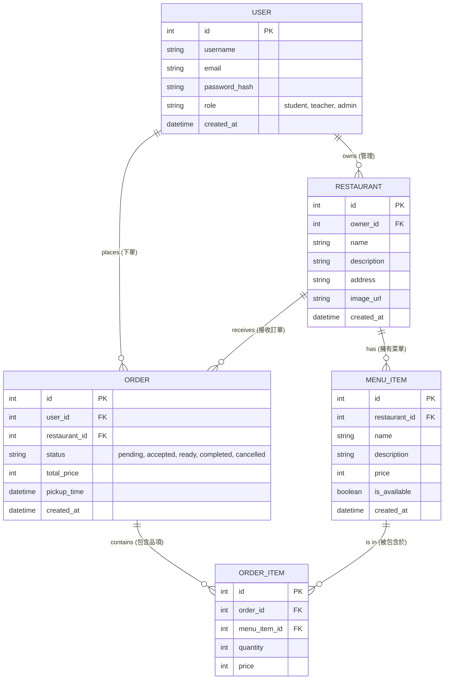

# 資料庫設計文件 (DB Design)

這份文件定義了「逢甲大學校園美食資訊平台」的資料庫結構。我們將採用 SQLite 作為資料庫，並透過 SQLAlchemy 進行 ORM 管理。

## 1. ER 圖（實體關係圖）

## 2. 資料表詳細說明

### USER (使用者表)
儲存所有平台使用者，包含學生、老師與店家管理者。
- `id`: INTEGER, Primary Key, 自動遞增。
- `username`: VARCHAR(50), 必填，使用者名稱。
- `email`: VARCHAR(120), 必填，唯一，登入用帳號。
- `password_hash`: VARCHAR(128), 必填，加密後的密碼。
- `role`: VARCHAR(20), 必填，身分（如：student, teacher, admin）。
- `created_at`: DATETIME, 必填，帳號建立時間。

### RESTAURANT (店家表)
儲存校園周邊的美食店家資訊。
- `id`: INTEGER, Primary Key, 自動遞增。
- `owner_id`: INTEGER, Foreign Key (USER.id)，關聯到管理該店家的使用者。
- `name`: VARCHAR(100), 必填，店家名稱。
- `description`: TEXT, 描述與營業時間等資訊。
- `address`: VARCHAR(200), 店家地址。
- `image_url`: VARCHAR(255), 店家橫幅圖片網址。
- `created_at`: DATETIME, 必填，建立時間。

### MENU_ITEM (菜單品項表)
儲存每個店家的餐點資訊。
- `id`: INTEGER, Primary Key, 自動遞增。
- `restaurant_id`: INTEGER, Foreign Key (RESTAURANT.id)，必填，所屬店家。
- `name`: VARCHAR(100), 必填，餐點名稱。
- `description`: TEXT, 餐點描述。
- `price`: INTEGER, 必填，價格。
- `is_available`: BOOLEAN, 必填，預設 true，是否供應中。
- `created_at`: DATETIME, 必填，建立時間。

### ORDER (訂單表)
儲存使用者的線上訂單主檔。
- `id`: INTEGER, Primary Key, 自動遞增。
- `user_id`: INTEGER, Foreign Key (USER.id)，必填，下單使用者。
- `restaurant_id`: INTEGER, Foreign Key (RESTAURANT.id)，必填，接單店家。
- `status`: VARCHAR(20), 必填，預設 'pending'（pending, accepted, ready, completed, cancelled）。
- `total_price`: INTEGER, 必填，訂單總金額。
- `pickup_time`: DATETIME, 必填，預計取餐時間。
- `created_at`: DATETIME, 必填，下單時間。

### ORDER_ITEM (訂單明細表)
儲存每筆訂單內包含哪些餐點與數量。
- `id`: INTEGER, Primary Key, 自動遞增。
- `order_id`: INTEGER, Foreign Key (ORDER.id)，必填，所屬訂單。
- `menu_item_id`: INTEGER, Foreign Key (MENU_ITEM.id)，必填，對應的菜單品項。
- `quantity`: INTEGER, 必填，購買數量。
- `price`: INTEGER, 必填，結帳當下的單價（避免未來菜單漲價影響歷史訂單）。

