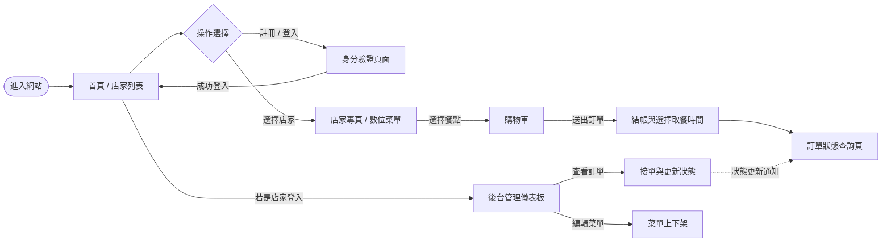
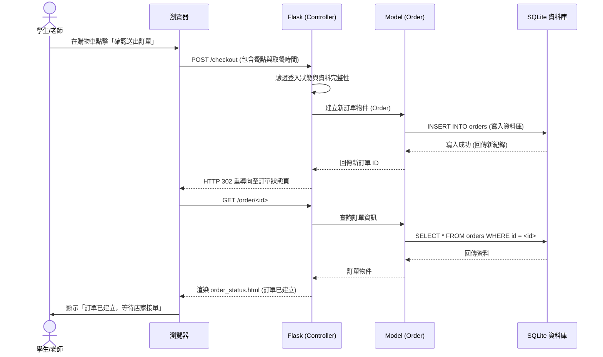

# 流程圖設計 (Flowchart)

這份文件描述了「逢甲大學校園美食資訊平台」的使用者操作路徑（User Flow）、系統資料互動的序列圖（Sequence Diagram）以及各功能的 URL 路由對照表。這將幫助開發團隊在實作路由前，釐清頁面間的跳轉關係與資料流向。

---

## 1. 使用者流程圖（User Flow）

此流程圖展示了學生/老師（一般使用者）與店家管理者在系統中的主要操作路徑。

---

## 2. 系統序列圖（Sequence Diagram）

以下序列圖以核心的**「使用者送出線上訂單」**流程為例，展示前端瀏覽器、後端 Flask、資料模型與 SQLite 資料庫之間的完整互動過程。

---

## 3. 功能清單對照表

開發路由 (Routes) 時，請參考以下對照表建立對應的 URL 與 HTTP 方法：

| 功能模組 | 詳細功能描述 | 建議 URL 路徑 | HTTP 方法 |
| :--- | :--- | :--- | :--- |
| **身分驗證** | 使用者註冊頁面與送出 | `/register` | GET, POST |
| | 使用者登入頁面與送出 | `/login` | GET, POST |
| | 使用者登出 | `/logout` | GET |
| **前台探索** | 首頁 (顯示所有店家列表與搜尋) | `/` 或 `/restaurants` | GET |
| | 檢視單一店家詳細資訊與數位菜單 | `/restaurant/<id>` | GET |
| **線上訂餐** | 檢視購物車與送出結帳 | `/checkout` | GET, POST |
| | 查看使用者的歷史與進行中訂單 | `/orders` | GET |
| | 查看單一訂單的最新狀態 | `/order/<id>` | GET |
| **店家後台** | 後台儀表板首頁 | `/admin` | GET |
| | 店家查看並更新顧客訂單狀態 | `/admin/orders` | GET, POST |
| | 店家新增、修改或下架菜單品項 | `/admin/menu` | GET, POST |
